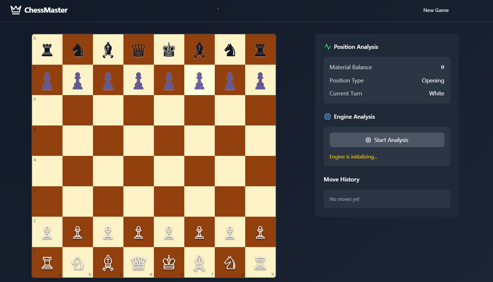

# ShatRanj - Advanced Chess Analysis Platform

A modern, feature-rich chess analysis platform built with React, TypeScript, and Tailwind CSS. Analyze games, study positions, and play against Stockfish engine.



## Features

- 🎮 Interactive chess board with smooth piece animations
- 📊 Real-time position analysis
- 🤖 Stockfish engine integration
- 📝 PGN game notation support
- ⏱️ Game timer functionality
- 📈 Material balance evaluation
- 🎯 Move history tracking
- 🎨 Beautiful, responsive UI with dark mode

## Getting Started

### Prerequisites

- Node.js 16.x or higher
- npm 7.x or higher

### Installation

1. Clone the repository:
```bash
git clone https://github.com/1enMap/shatranj.git
cd shatranj
```

2. Install dependencies:
```bash
npm install
```

3. Start the development server:
```bash
npm run dev
```

The application will be available at `http://localhost:5173`

## Usage

### Loading a Game

1. Click on the "Load PGN" section
2. Paste your PGN notation in the format:
```
[Event "World Championship Match"]
[Site "London, England"]
[Date "2024.03.14"]
[Round "1"]
[White "Player 1"]
[Black "Player 2"]
[Result "*"]

1. e2 to e4 e7 to e5
2. g1 to f3 b8 to c6
```
3. Click "Load Game" to visualize the game

### Analysis Features

- **Position Analysis**: View material balance and position evaluation
- **Engine Analysis**: Get Stockfish engine recommendations
- **Move History**: Review all moves played in the current game
- **Game Timer**: Track time for both players
- **Material Count**: Monitor captured pieces and material advantage

## Technology Stack

- **Frontend Framework**: React 18
- **Language**: TypeScript
- **Styling**: Tailwind CSS
- **State Management**: Zustand
- **Chess Engine**: Stockfish (WebAssembly)
- **Icons**: Lucide React
- **Build Tool**: Vite

## Project Structure

```
src/
├── components/        # React components
├── hooks/            # Custom React hooks
├── store/            # Zustand store
├── types/            # TypeScript type definitions
├── utils/            # Utility functions
└── workers/          # Web Workers for Stockfish
```

## Contributing

1. Fork the repository
2. Create your feature branch (`git checkout -b feature/AmazingFeature`)
3. Commit your changes (`git commit -m 'Add some AmazingFeature'`)
4. Push to the branch (`git push origin feature/AmazingFeature`)
5. Open a Pull Request

## License

This project is licensed under the MIT License - see the [LICENSE](LICENSE) file for details.

## Acknowledgments

- [Stockfish](https://stockfishchess.org/) for the chess engine
- [Lucide](https://lucide.dev/) for the beautiful icons
- [Tailwind CSS](https://tailwindcss.com/) for the styling system
